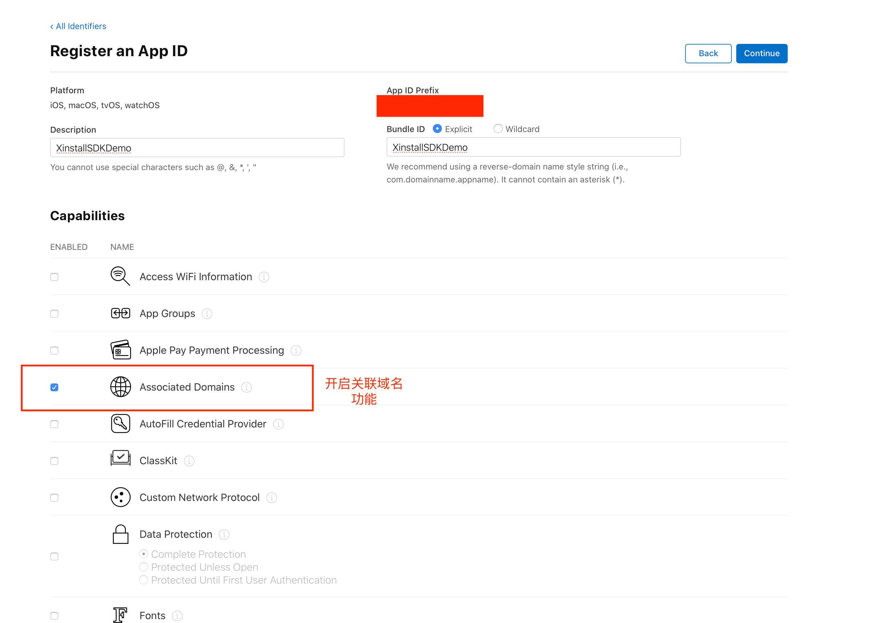
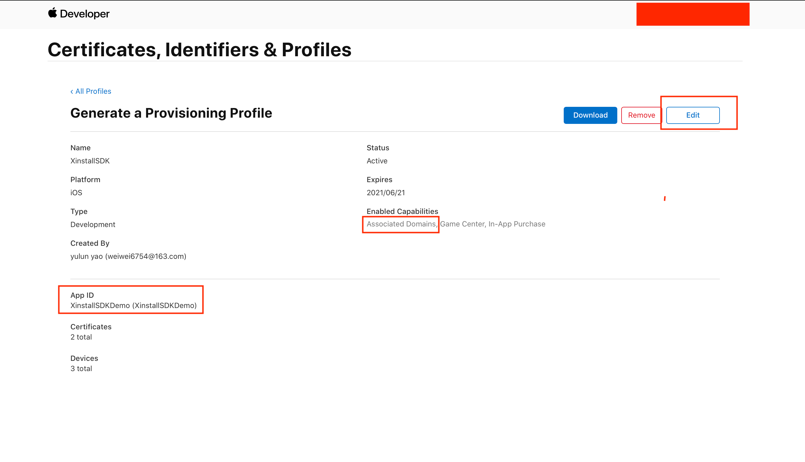
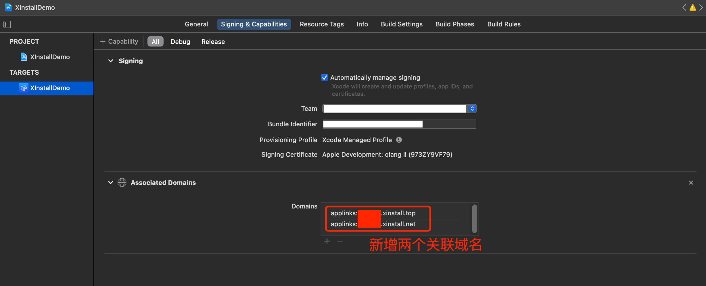
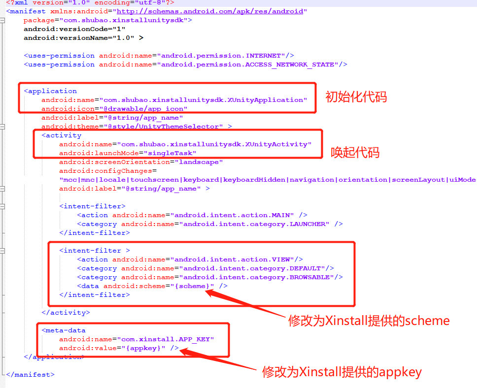

# Xinstall-Unity-SDK

> 本SDK 主要为了Unity同学快速集成XinstallSDK 而开发

### 一、导入XinstallUnitySDK.unitypackage

右击Assets,选择 `Import Package` 中的 `Custom Package...`

选中`XinstallUnitySDK.unitypackage`，导入文件

### 二、Unity 集成

#### 获取unitySDK 处理对象

1. 将package导入的文件中的 `Xinstall/XinstallBehaviour.prefab` 拖入对应的应用场景中

2. 导入命名空间

   ```c#
   using com.shubao.xinstallunitysdk;
   ```

3. 然后通过 `GameObject`获取 `XinstallBehavior` 的实例

   ```c#
   private XinstallBehaviour xinstall;
   void Start() {
     		xinstall = GameObject.Find("XinstallBehaviour").GetComponent<XinstallBehaviour>(); 
   }
   ```

#### 集成相关功能


##### 1. 一键拉起

​     	使用该功能需要分别在Unity导出的iOS 和 Android项目中配置，具体可以在配置好Unity 之后再配置。

​		 在 `Start` 方法中，获取到实例之后注册拉起回调，这样当 App 被拉起时，会回调方法，并可在回调中获取拉起数据。

```C#
xinstall.RegisterWakeupHandler(getWakeupData);
```
```C#
public void getWakeupData(XinstallData wakeupData) {
        Debug.Log("XinstallSample getWakeupData : 渠道编号=" +wakeupData.channelCode + "， 自定义数据=" + wakeupData.data);
        //wakeupResult.text = "拉起参数：" + JsonUtility.ToJson(wakeupData);
 }
```

##### 2. 安装参数传递

超时时间仅对android 有效果。

```c#
xinstall.getInstallParam(10,getInstallData);
```

```c#
public void getInstallData(XinstallData installData) {
         Debug.Log("XinstallSample getInstallData : 渠道编号=" + installData.channelCode + "，自定义数据=" + installData.data + "，是否是第一次安装=" + installData.isFirstFetch);
        //installResult.text = "安装参数：" + JsonUtility.ToJson(installData);
}
```

**备注**：UnitySDK 对iOS 原生SDK 有进行二次封装，以替代直接通过原生SDK 通过installData属性获取XinstallData的使用。

##### 3.渠道事件统计

###### 3.1注册事件上报

用户注册成功后，可以调用接口上报注册事件

```c#
xinstall.reportRegister();
```

###### 3.2 自定义事件上报

用户可以通过此方法上传相关事件。该事件主要用来统计运营相关数据。但上传之前需要在B端后台创建相关事件，且事件ID需要相同。

```c#
xinstall.reportEffectEvent("effectId",1);
```

### 三、平台配置

#### iOS平台配置

 iOS 不需要写任何代码，只要进行一些简单的配置

**备注** ：

- 如果用户使用了 `IMPL_APP_CONTROLLER_SUBCLASS` 宏生成自己的 `XinstallAppController`,请在自己的 `XinstallAppController` 中添加初始化方法和拉起回调方法，并删除掉 `Assets/Plugins/iOS/libs` 中的 `XinstallAppController.mm` 文件；

##### 1. 配置 Info.plist 文件

​		在 Info.plist 文件中配置 appKey 键值对，如下：

```xml
<key>com.xinstall.APP_KEY</key>
<string>6ud3sov</string>
```

##### 2. 配置Universal Link 相关

1. 首先，我们需要到[苹果开发者网站](https://developer.apple.com/)，为当前的App ID开启关联域名(Associated Domains)服务：

   

   2. 为刚才开发关联域名功能的AppID**创建**新的（或更新现有的）**描述文件**，下载并导入到XCode中。

      注：通过xcode自动生成的描述文件，可跳过这一步

      

   3. 在XCode中配置Xinstall为当前应用生成的关联域名(Associated Domains)

      **具体可以在Xinstall的控制台中找到**，类似**applinks:xxxxxxx.xinstall.top**

      

#### Android平台配置

##### 1. 简单配置  

将导入的unityPackage里的`Assets/Plugin/Android/`目录下的AndroidManifest.xml 的`{scheme}`和`(appKey)`替换**Xinstall分配的 AppKey 和 scheme**.(scheme 的具体位置在**Xinstall应用控制台**->**Android集成**->**功能集成**)

##### 2. 自定义配置  

1. **如果项目已存在自己的`AndroidManifest.xml`文件**，根据下图标注的内容做相应的更改： 
   

2. **如果拥有自己的Application**，可参考`AndroidSample`目录中的`XUnityApplication.java`修改自己的Application对 Xinstall 进行初始化，此时`AndroidManifest.xml`中的application设置仍然使用自己的Application

3. **如果需要使用自己的拉起Activity**，可参考`AndroidSample`目录中的`XUnityActivity.java`在拉起Activity的onCreate(Bundle savedInstanceState)和onNewIntent(Intent intent)中添加拉起处理代码
4. **如果有上架应用宝**,可参考`AndroidSample`目录中的`XUnityActivity.java`在拉起Activity的onResume()中添加拉起处理代码


### 四、导出apk/ipa包并上传

参考官网文档

[iOS集成-导出ipa包并上传](https://doc.xinstall.com/integrationGuide/iOSIntegrationGuide.html#四、导出ipa包并上传)

[Android-集成](https://doc.xinstall.com/integrationGuide/AndroidIntegrationGuide.html#四、导出apk包并上传)

### 五、如何测试功能

参考官方文档 [测试集成效果](https://doc.xinstall.com/integrationGuide/comfirm.html)

### 六、更多 Xinstall 进阶功能

若您想要自定义下载页面，或者查看数据报表等进阶功能，请移步 [Xinstall 官网](https://xinstall.com) 查看对应文档。

若您在集成过程中如有任何疑问或者困难，可以随时[联系 Xinstall 官方客服](https://admin.qidian.qq.com/template/blue/mp/menu/qr-code-jump.html?linkType=0&env=ol&kfuin=2355021609&fid=350&key=4576bf1f33461342433de54b612d61a0&cate=1&type=16&ftype=1&_type=wpa&qidian=true) 在线解决。

