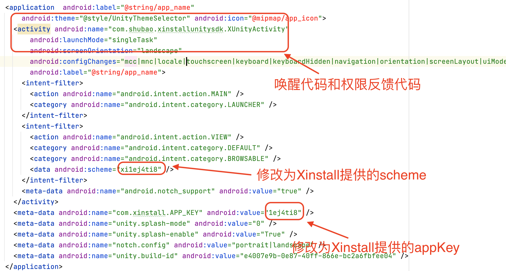

# Xinstall-Unity-SDK

> 本SDK 主要为了Unity同学快速集成XinstallSDK 而开发

### 一、导入XinstallUnitySDK.unitypackage

右击Assets,选择 `Import Package` 中的 `Custom Package...`

选中`XinstallUnitySDK.unitypackage`，导入文件

### 二、Unity 集成

#### 获取unitySDK 处理对象

1. 将package导入的文件中的 `Xinstall/XinstallBehaviour.prefab` 拖入对应的应用场景中

2. 导入命名空间

   ```c#
   using com.shubao.xinstallunitysdk;
   ```

3. 然后通过 `GameObject`获取 `XinstallBehavior` 的实例

   ```c#
   private XinstallBehaviour xinstall;
   void Start() {
     		xinstall = GameObject.Find("XinstallBehaviour").GetComponent<XinstallBehaviour>(); 
   }
   ```

#### 初始化处理

> 在 1.5.0 之后 Unity XinstallSDK 需要手动集成初始化代码（iOS 将写在XinstallAppController类内的init初始化注释了，Android 也将XUnityApplication 类去除了）

##### 初始化代码调用

```c#
xinstall.init();
```

#### 集成相关功能

##### 1. 一键拉起

​     	使用该功能需要分别在Unity导出的iOS 和 Android项目中配置，具体可以在配置好Unity 之后再配置。

​		 在 `Start` 方法中，获取到实例之后注册拉起回调，这样当 App 被拉起时，会回调方法，并可在回调中获取拉起数据。

```C#
xinstall.RegisterWakeupHandler(getWakeupData);
```
```C#
public void getWakeupData(XinstallData wakeupData) {
        Debug.Log("XinstallSample getWakeupData : 渠道编号=" +wakeupData.channelCode + "， 自定义数据=" + wakeupData.data);
        //wakeupResult.text = "拉起参数：" + JsonUtility.ToJson(wakeupData);
 }
```

##### 2. 安装参数传递

超时时间仅对android 有效果。

```c#
xinstall.getInstallParam(10,getInstallData);
```

```c#
public void getInstallData(XinstallData installData) {
         Debug.Log("XinstallSample getInstallData : 渠道编号=" + installData.channelCode + "，自定义数据=" + installData.data + "，是否是第一次安装=" + installData.isFirstFetch);
        //installResult.text = "安装参数：" + JsonUtility.ToJson(installData);
}
```

**备注**：UnitySDK 对iOS 原生SDK 有进行二次封装，以替代直接通过原生SDK 通过installData属性获取XinstallData的使用。

##### 3.渠道事件统计

###### 3.1注册事件上报

用户注册成功后，可以调用接口上报注册事件

```c#
xinstall.reportRegister();
```

###### 3.2 自定义事件上报

用户可以通过此方法上传相关事件。该事件主要用来统计运营相关数据。但上传之前需要在B端后台创建相关事件，且事件ID需要相同。

```c#
xinstall.reportEffectEvent("effectId",1);
```

### 三、平台配置

#### iOS平台配置

 iOS 不需要写任何代码，只要进行一些简单的配置

**备注** ：

- 如果用户使用了 `IMPL_APP_CONTROLLER_SUBCLASS` 宏生成自己的 `XinstallAppController`,请在自己的 `XinstallAppController` 中添加初始化方法和拉起回调方法，并删除掉 `Assets/Plugins/iOS/libs` 中的 `XinstallAppController.mm` 文件；

##### 1. 配置 Info.plist 文件

​		在 Info.plist 文件中配置 appKey 键值对，如下：

```xml
<key>com.xinstall.APP_KEY</key>
<string>6ud3sov</string>
```

##### 2. 配置Universal Link 相关

1. 首先，我们需要到[苹果开发者网站](https://developer.apple.com/)，为当前的App ID开启关联域名(Associated Domains)服务：

   

   2. 为刚才开发关联域名功能的AppID**创建**新的（或更新现有的）**描述文件**，下载并导入到XCode中。

      注：通过xcode自动生成的描述文件，可跳过这一步

      

   3. 在Xcode中配置Xinstall为当前应用生成的关联域名(Associated Domains)： **applinks:xxxxxxx.xinstall.top** 和 **applinks:xxxxxxx.xinstall.net**

      > 具体的关联域名可在 Xinstall管理后台 - 对应的应用控制台 - iOS下载配置 页面中找到

      

##### 3. 配置Scheme

<font color=#FF0000 >此方法为XinstallSDK 1.2.2最新添加的方法，如果使用报错，请先更新SDK
更多问题见</font>[iOS常见问题](../QA/iOSWrong.html#4%E3%80%81%E4%B8%BA%E4%BB%80%E4%B9%88sdk%E7%9A%84%E6%96%B9%E6%B3%95%E5%92%8C%E6%96%87%E6%A1%A3%E4%B8%AD%E7%9A%84%E6%96%B9%E6%B3%95%E4%B8%8D%E4%B8%80%E8%87%B4)

在Xcode选中**Target**  ->  **Info**  ->  **URL Types**,配置**Xinstall** 为当前应用生成的 Scheme,如图所示：


图中4中的值为实例值，具体为xi+appkey格式，如xi4z9yxu8，您也可以在[iOS集成-功能集成-一键拉起](https://www.xinstall.com/admin/integration/ios#2)的文档中找到您对应的Scheme值


#### Android平台配置

##### 1. 简单配置  

将导入的unityPackage里的`Assets/Plugin/Android/`目录下的AndroidManifest.xml 的`{scheme}`和`(appKey)`替换**Xinstall分配的 AppKey 和 scheme**.(scheme 的具体位置在**Xinstall应用控制台**->**Android集成**->**功能集成**)

##### 2. 自定义配置  

1. **如果项目已存在自己的`AndroidManifest.xml`文件**，根据下图标注的内容做相应的更改： 
   


### 四、 广告平台渠道功能接入

> 如果您在 Xinstall 管理后台对应 App 中，**只使用「自建渠道」，而不使用「广告平台渠道」，则无需进行本小节中额外的集成工作**，也能正常使用 Xinstall 提供的其他功能。
>
> 注意：根据目前已有的各大主流广告平台的统计方式，目前 iOS 端和 Android 端均需要用户授权并获取一些设备关键值后才能正常进行 [ 广告平台渠道 ] 的统计，如 IDFA / OAID / GAID 等，对该行为敏感的 App 请慎重使用该功能。

##### 4.1 配置工作

**iOS 端：**

在 Xcode 中打开 iOS 端的工程，在 `Info.plist` 文件中配置一个权限作用声明（如果不配置将导致 App 启动后马上闪退）：

```xml
<key>NSUserTrackingUsageDescription</key>
<string>这里是针对获取 IDFA 的作用描述，请根据实际情况填写</string>
```

在 Xcode 中，找到 App 对应的「Target」，再点击「General」，然后在「Frameworks, Libraries, and Embedded Content」中，添加如下两个框架：

* AppTrackingTransparency.framework
* AdSupport.framework

**Android 端：**

  相关接入可以参考广告平台联调指南中的[《Android集成指南》](https://doc.xinstall.com/AD/AndroidGuide.html)

1. 接入IMEI需要额外的全下申请，需要在`AndroidManifest`中添加权限声明

   ```java
   <uses-permission android:name="android.permission.READ_PHONE_STATE"/>
   ```

2. 如果使用OAID，因为内部使用反射获取oaid 参数，所以都需要外部用户接入OAID SDK 。具体接入参考[《Android集成指南》](https://doc.xinstall.com/AD/AndroidGuide.html)

##### 4.2 更换初始化方法

**使用新的 initWithAd 方法，替代原先的 init 方法来进行模块的初始化**

> iOS 端使用该方法时，需要传入 IDFA（在 c# 脚本内）。您可以使用任意方式在 C# 脚本中获取到 IDFA，例如第三方获取 IDFA 的模块。
>
> Android 端、oaid 和 gaid 可外部传入也可SDK获取。oaid需要接入OAID SDK。

**入参说明**：需要主动传入参数，字典

入参内部字段：

* iOS 端：

  | 参数名 | 参数类型 | 描述                   |
  | ------ | -------- | ---------------------- |
  | idfa   | 字符串   | iOS 系统中的广告标识符 |

* Android 端：

  | 参数名        | 参数类型 | 描述               |
  | ------------- | -------- | ------------------ |
  | adEnabled     | boolean  | 是否使用广告功能   |
  | oaid （可选） | string   | OAID               |
  | gaid（可选）  | string   | GaID(google Ad ID) |


##### 调试示例

```c#
xinstall = GameObject.Find("XinstallBehaviour").GetComponent<XinstallBehaviour>(); 

XinstallAdConfig adConfig = new XinstallAdConfig();
// Android 必传参数-----------------
adConfig.isAdOpen = true;
// Android 选传参数-----------------
// advertisingId(gaid) 为null 则gaid 会在SDK自动获取
adConfig.advertisingId = "测试gaid";
// oaid 为null 则 oaid 会在SDK内部通过反射自动获取
adConfig.oaid = "测试oaid";

// iOS 必传参数	
adConfig.idfa = "测试idfa";
// 打开SDK 日志服务
xinstall.setLog(true);
// 广告集成初始化
xinstall.initWithAd(adConfig);
```

##### 4.3、上架须知

**在使用了广告平台渠道后，若您的 App 需要上架，请认真阅读本段内容。**

##### 4.3.1 iOS 端：上架 App Store

1. 如果您的 App 没有接入苹果广告（即在 App 中显示苹果投放的广告），那么在提交审核时，在广告标识符中，请按照下图勾选：


1. 在 App Store Connect 对应 App —「App隐私」—「数据类型」选项中，需要选择：**“是，我们会从此 App 中收集数据”**：


在下一步中，勾选「设备 ID」并点击【发布】按钮：


点击【设置设备 ID】按钮后，在弹出的弹框中，根据实际情况进行勾选：

- 如果您仅仅是接入了 Xinstall 广告平台而使用了 IDFA，那么只需要勾选：**第三方广告**
- 如果您在接入 Xinstall 广告平台之外，还自行使用 IDFA 进行别的用途，那么在勾选 **第三方广告** 后，还需要您根据您的实际使用情况，进行其他选项的勾选


勾选完成后点击【下一步】按钮，在 **“从此 App 中收集的设备 ID 是否与用户身份关联？”** 选项中，请根据如下情况进行选择：

- 如果您仅仅是接入了 Xinstall 广告平台而使用了 IDFA，那么选择 **“否，从此 App 中收集的设备 ID 未与用户身份关联”**
- 如果您在接入 Xinstall 广告平台之外，还自行使用 IDFA 进行别的用途，那么请根据您的实际情况选择对应的选项


最后，在弹出的弹框中，选择 **“是，我们会将设备 ID 用于追踪目的”**，并点击【发布】按钮：


## 导出 APK / IPA 包并上传

参考官网文档

[iOS集成-导出ipa包并上传](https://doc.xinstall.com/integrationGuide/iOSIntegrationGuide.html#四、导出ipa包并上传)

[Android-集成](https://doc.xinstall.com/integrationGuide/AndroidIntegrationGuide.html#四、导出apk包并上传)


## 如何测试功能

参考官方文档 [测试集成效果](https://doc.xinstall.com/integrationGuide/comfirm.html)


## 更多 Xinstall 进阶功能

若您想要自定义下载页面，或者查看数据报表等进阶功能，请移步 [Xinstall 官网](https://xinstall.com/) 查看对应文档。

若您在集成过程中如有任何疑问或者困难，可以随时[联系 Xinstall 官方客服](https://wpa1.qq.com/qsw1OZaM?_type=wpa&qidian=true) 在线解决。

### 五、导出apk/ipa包并上传

参考官网文档

[iOS集成-导出ipa包并上传](https://doc.xinstall.com/integrationGuide/iOSIntegrationGuide.html#四、导出ipa包并上传)

[Android-集成](https://doc.xinstall.com/integrationGuide/AndroidIntegrationGuide.html#四、导出apk包并上传)

### 六、如何测试功能

参考官方文档 [测试集成效果](https://doc.xinstall.com/integrationGuide/comfirm.html)

### 七、更多 Xinstall 进阶功能

若您想要自定义下载页面，或者查看数据报表等进阶功能，请移步 [Xinstall 官网](https://xinstall.com) 查看对应文档。

若您在集成过程中如有任何疑问或者困难，可以随时[联系 Xinstall 官方客服](https://admin.qidian.qq.com/template/blue/mp/menu/qr-code-jump.html?linkType=0&env=ol&kfuin=2355021609&fid=350&key=4576bf1f33461342433de54b612d61a0&cate=1&type=16&ftype=1&_type=wpa&qidian=true) 在线解决。

